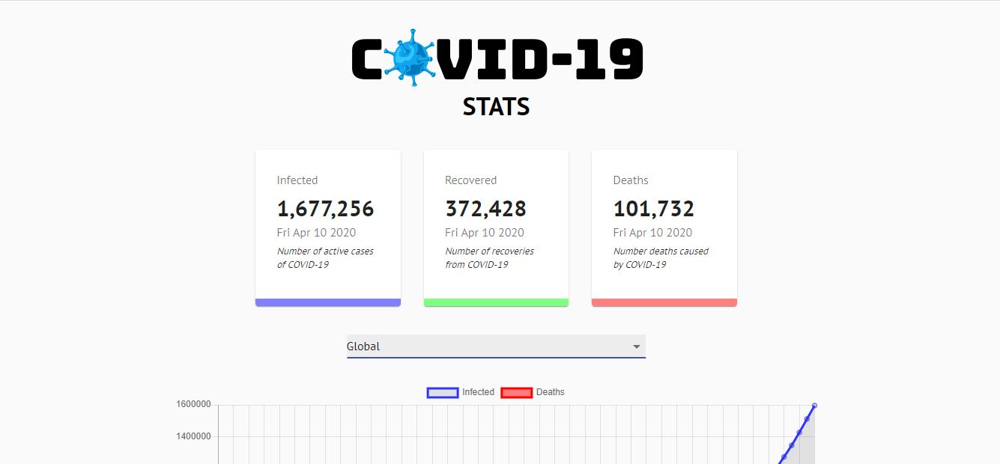

# COVID-19 Tracker

A COVID-19 tracker app built with React.js, Chart.js, and Material UI.

Visit deployed application [here.](https://track-covid19-cases.herokuapp.com/)

## Description

While the Coronavirus pandemic continues to impact health and economic well-being across the globe, I wanted to create something that could help my family and friends monitor the situation. The goal of this application is to help users access and visualize the latest data and track COVID-19 cases around the world.

## Preview

